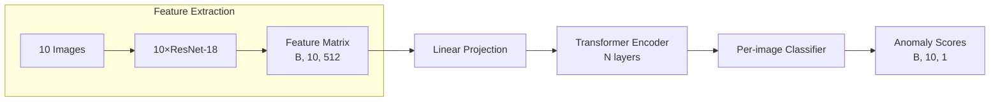

# Experiment Log Phase 2: Detail Model Architecture & Data Flow

**Date**: December 7, 2025
**Experiment ID**: EXP-PH2-01
**Task**: Set anomaly detection in CIFAR100 (10-image sets, 1 anomaly)
**Goal**: Verify custom Transfer-based anomaly predictor log full data flow from image set-final logits

---

## Objective

Ensure model
- Is trainable end-to-end (despite frozen backbone)
- outputs 10 anomaly scores (one per image)
- Process them through attention without positional bias
- Extract frozen ResNet18 features(512-dim)
- Correctly ingests sets of 10 images

---

### Hypothesis

A multi-head scaled dot-product attention mechanism operating on frozen ResNet18 features can learn to compare intra-set image relationships and assign higher anomaly scores to the out-of-class image, achieving >30% top-1 accuracy.

### Architectural Diagram


*Diagram viewable with `markdown preview mermaid` vscode extension

---

### Data Flow

| step | Module | Input Shape | Output Shape | Key Parameters |Notes|
|------|--------|-------------|--------------|-------|-----|
| 0    | Input  | `[B, 10, 3, 32, 32]`| -   | B = batch_size| Sampled from CIFAR-100 images 10 per set|
| 1    | Resize + Feature Extraction |`[B, 10, 3, 32, 32]`|`[B, 10, 512]`|In `SetAnomalyDataset.__getitem__` Resize to 224x224, ResNet18(frozen) `avgpool` output|Per-image features|
| 2    | Input Projection | `[B, 10, 512]`|`[B, 10, 256]`| Linear(512->256) + input dropout (currently 0.0)|
| 3    | TransformerEncoder | `[B, 10, 256]`|`[B, 10, 256]`| `num_heads=4, dropout=0.1`|4 layers, 4 heads, full pairwise attention, no PE|
| 4    | Per position Classifier|`[B, 10, 256]`|`[B, 10, 1]`|`Linear(256,1)`|Shared MLP per position|
| 5    | Output |`[B, 10, 1]`| `torch.squeeze(-1)` | `[B, 10]` | saclar per set |`CrossEntropyLoss`|
---

*Note: Positional encoding disable - see Design choice
Feature extraction is now part of the data pipeline (Step 1), not the model.
The model starts at Step 2 (Input Projection).

### Data Configuration (updated for Phase 2)

- **Source**: CIFAR-100 (20 superclasses $\times$ 1 subclass = 20 classes)
- **Set Construction**:
    - Each set: 9 images from ca + 1 image from c0 = ca
    - Shuffled -> ground truth = anomaly index (0-9)
- **Splits**:
    - Training: 8000 sets (from CIFAR-100 train)
    - Validation: 2000 sets (from CIFAR-100 train, different seed)
    - Test: 2000 sets (from CIFAR-100 test)
- **Feature Extraction**:
    - ResNet18 (ImageNet-pretrained, frozen) applied during data loading
    - Input images: $32 \times 32 \rightarrow $ resized to $224 \times 224$ via bilinear interpolation
    - Output: 512-dim feature vectors per image
    - Implementation: `SetAnomalyDataset` extracts features in `__getitem__` using `torchvision.models.resnet18`

 ---


### Key Design Choices & Rational

#### **Frozen ResNet-18 Features**
- **Why frozen?** 
  - Pretrained ImageNet features provide strong generic representations
  - Reduces trainable parameters by 99% (11M → 0.3M)
  - Prevents overfitting on small dataset (10k sets)
- **Validation**: Verified gradient flow = 0 in ResNet layers

#### Attention Mechanism Specification

#### **Scaled Dot-Product Attention (vs. Alternatives)**
| Mechanism | Compute Cost (10 tokens) | Parameters | Suitability |
|-----------|--------------------------|------------|-------------|
| Additive (Bahdanau) | $( O(d \cdot n^2) )$ | 2× more | Overkill for small sets |
| **Scaled Dot-Product** | $( O(n^2) )$ | Minimal | Optimal for $( n=10 )$ |
| Linear Attention | $( O(n) )$ | Extra projections | Unnecessary for small \( n \) |
---

#### 2. Masking Policy
- **Active?**: No
- **Type**: Not applicable (no Causal, padding, or block masking used)
- **Reason**: 
    The input consists of fixed-size, unordered sets of exactly 10 images. Therefore:
    - There is no sequential dependency (ruling out causal masks),
    - There is no padding (all sets are complete, ruling out padding masks)
    - The task requires full pairwise comparison among all 10 images.

- Code Enforcement:
    - All model calls explicitly pass `mask=None`
        
        ```python
        # In AnomalyPredictor
        preds = self.forward(img_sets, mask=None)
        ```
    - The `expand_mask` utility (below) is never invoked during training or inference:

        ```python
        def expand_mask(mask):
            assert mask.ndim >= 2, \
                "Mask must be at least 2D (seq_len x seq_len)"
            if mask.ndim == 3:
                mask = mask.unsqueeze(1) # [B, L, L] -> [B, 1, L, L]
            while mask.ndim <4:
                mask = mask.unsqueeze(0) # ensure [B, 1, L, L]
            return mask
        ```

    - Safety check: If a non-`None` mask where accidentally passed, `expand_mask` would broadcast it to the expected `[B, 1, L, L]` shape for multi-head compatibility-but this does not occur in this experiment.

    - During training, `MultiheadAttention.forward(x, mask=None)` skips mask processing entirely, ensuring unrestricted attention over all 10 image positions.


   


### Module Specification 

<!-- 2. PositionalEncoding
    - Purpose: Adds sinusoidal position embeddings
    - Validation:
        - Check pe buffer shape = `[1, 5000, d_model]`
        - Verify `forward` adds correctly without changing input shape
    Input: [B, L, d_model] = [B, 10, 512]
    PE Buffer: [1, 5000, 512]
    Output: [B, L, d_model] = [B, 10, 512] + pe[:, :10, :]

Note: Not used in AnomalyPredictor -> Confirmed via add_positional_encoding=False -->

### Module: Scaled Dot Product
- Location: `model/attention.py`
- Role: Core attention computation (no parameters, no state)
- Signature:

    ```python
        
    def scaled_dot_product(q,k,v, mask=None)->Tuple[torch.Tensor, torch.Tensor]:
        """
        Args:
            q, k, v: [Batch, Heads, Seq_len, HeadDim]
            mask: Optional [Batch, Heads, SeqLen, SeqLen] (0 = masked)
        Returns:
            values: [Batch, Heads, SeqLen, HeadDim]
            attention: [Batch, Heads, SeqLen, SeqLen]
    ```

- Operations:
    1. compute logits: $$logits = Q@K^T$$
    2. Scale: $$logit \leftarrow logits /= \sqrt{d_k}$$
    3. Apply mask: logits.masked_fill(mask == 0, -9e15)
    4. Softmax: $$A = \text{softmax}(logits)$$
    5. Output: $$V_{out} = A \cdot V$$


### Module: MultiheadAttention (nn.Module)
- Location: `model/attention.py`
- Role: Project inputs ->Q/K/V, splits into heads, calls `scaled_dot_product`
- initialization parameters:

    | parameter| Value | Description|
    | :--- | :-- | :--- |
    | `input_dim` | $256$ | Dimension of the input features |
    | `embed_dim` | $256$ | Output embedding dimension |
    | `num_heads` | $4$ | Number of attention heads ($H$) |
    |**`d_h` (head Dimension)**| $64$|$d_{embed} / H = 256 / 4 $|
    ---

    Learnable Parameters
    **`qkv_proj`**: **Linear** layer to project input inot Q, k, and V vectors
    
    Size: `Linear(256, 768)` (Since $768 = 3 \times 256 $ for Q, K, V combined)

    **`o_proj`**: **Linear** layer to combine the outputs from all heads back into the final embedding dimension.
    
    Size: `Linear(256, 256)`

- Key Shape Transformations:

| Step | Operation | Resulting Shape |
| :--- | :--- | :--- |
| **Input** | Initial input $\mathbf{x}$. | $\mathbf{x} \in \mathbb{R}^{B \times L \times 256}$ |
| **Projection** | $\mathbf{qkv} = \text{Linear}(\mathbf{x})$. | $\mathbf{qkv} \in \mathbb{R}^{B \times L \times 768}$ |
| **Reshape** | `.view(B, L, H, 3 \cdot d_h)`. | $\in \mathbb{R}^{B \times L \times 4 \times 192}$ |
| **Permute** | `.permute(0, 2, 1, 3)` (Transpose sequence and head dimensions). | $\in \mathbb{R}^{B \times H \times L \times 3 \cdot d_h}$ |
| **Split** | `.chunk(3, \text{dim}=-1) \rightarrow Q, K, V$. | $\mathbf{Q}, \mathbf{K}, \mathbf{V} \in \mathbb{R}^{B \times H \times L \times d_h}$ |
| **Attention** | Call `scaled_dot_product(Q, K, V)`. | Output $\mathbf{V}_{out} \in \mathbb{R}^{B \times H \times L \times d_h}$ |
| **Rejoin Heads (Permute)** | $\mathbf{V}_{out}.\text{permute}(0, 2, 1, 3)$. | $\in \mathbb{R}^{B \times L \times H \times d_h}$ |
| **Rejoin Heads (Reshape)** | $`.reshape(B, L, 256)$ | $\in \mathbb{R}^{B \times L \times \text{embed\_dim}}$ |
---

1. Input: $\mathbf{x} \in \mathbb{R}^[B, L, 256]$
2. Projection: $\text{qkv} = \text{Linear}(\mathbf{x}) \in \mathbb{R}^{B \times L \times H \times 3 D_{h}}$
3. Reshape: `qkv.view(B, L, 4, 192) $\rightarrow$ [B, L, H, 3 \times D_h]`
4. Permute: `qkv.permute(0, 2, 1, 3) $\rightarrow$ [B, H, L, 3 \times D_h]`
-> Enables head-wise attention computation
5. Split: `chunk(3, dim=-1) $\rightarrow$ Q, K, V \in [B, H, L, D_h]`
6. Attention: Call `scaled_dot_product(Q, K, V)`
7. Rejoin Heads
    - `values.permute(0, 2, 1, 3) $\rightarrow$ [B, L, H, D_h]`
    - `reshape(B, L, 256) \rightarrow [B, L, embed_dim]`


### Module: EncoderBlock (nn.Module)
- Location: `model/transformer.py`
- Role: Single Transformer encoder layer with post-layer normalization and residual connections
- Architecture Parameters

| Component | Configuration | Rationale|
| :---      | :---          | :---     |
|Input Dim  | $D = 256$| Matches projectd ResNet features|
| Attention heads| $H = 4$| Standard choice; $D/H = 64stable$|
| MLP hidden dim| $D_{ff} = 512$| $2 \times D$ (as )|
| Dropout| $p = 0.1$| Applied after residuals|
| Normalization| Post-LN: residual $\rightarrow$ LayerNorm|Simpler to train for small models|
---

- Flow Pass:
    Given input $\mathbf{x} \in \mathbb{R}^{B \times L \times D}$
    
    1. Attention: $a = \text{MHA}(\mathbf{x}, mask)$
    2. Residual + Dropout: $\mathbb{x}_{1} = \mathbb{x} + \text{Dropout}(a)$
    3. LayerNorm: $\mathbb{x}_{2} = \text{LayerNorm}(\mathbb{x}_{1})$
    4. MLP: $\mathbf{m} = \text{MLP}\mathbf{x}_{2} = \text{W}_{2}(\text{ReLU}(\text{W}_{1}\mathbf{x}_{2}))$
    5. Residual + Dropout: $\mathbf{x}_{3} = \mathbf{x}_{2} + \text{Dropout}(m)$
    6. LayerNorm: $\text{output} = \text{LayerNorm}(\mathbf{x}_{3})$

    `x->MHA(x)->+residual x->LN->MLP->+residual x->LN`


- MLP: 256->512->Dropout(0.1)->ReLU->256
<!-- - Dropout: Applied after MHA and MLP residuals -->
- Test: Identity behavoir when `dropout=0` and `MLP=Linear=x`

 
### Module: TransformerEncoder  (nn.Module)
- Location: `model/transformer.py`
- Role: Stacks $N=4$ `EncoderBlock` layers to enable deep relational reasoning.
- Forward Pass

    - Input: $\mathbf{x} \in \mathbb{R}^{B \times 10 \times 256}$
    - processing:
        $$ \mathbf{x} \xrightarrow{Layer_{1}} \mathbf{x}^{(1)} \xrightarrow{Layer_{2}} \cdots \xrightarrow{Layer_{4}} \mathbf{x}^{(4)}$$
    - Output: $\mathbf{x}^{(4)} \in \mathbb{R}^{B \times 10 \times 256}$

- output Specification
    - Attention maps: List of 4 tensors, each of shape [B, H, L, L] = [B, 4, 10, 10]
    - Use case: Visualize which image position attend to the anomaly.
   
    *Note: Attention maps are extracted in a separate pass without updating hidden states. Suitable for visualization, not gradient-based analysis.
    <!-- - Layer 1 -> Layer 2 -> ... -> Layer 4 -->
    
    <!-- - Stack N=4 blocks EncoderBlock
    - get attention maps: useful for debugging -> returns list of [B, H, L, L] per layer
    - Attention Maps: List[4 x (B, 4, 10, 10)] -->


### Module: TransformerPredictor (LightningModule)
- Location: `model/predictor.py`
- Role: End-to-end set processing pipeline with configurable transformer.
- Architecture

|Component|Specification|
|---------|-------------|
|Input Net|`Dropout(0.1)` $\rightarrow$ `Linear(512, 256)`|
|Transformer| 4-layer `TransformerEncoder`: `model_dim=256`, `num_heads=4`, `dim_forward=512` (2 * 256), `dropout=0.1`|
| Output Net| `Linear(256->256)` $\rightarrow$ `LayerNorm` $\rightarrow$ `ReLU` $\rightarrow$ `Dropout(0.1)` $\rightarrow$ `Linear(256->1)`|
|Positional Encoding| Disabled (`adding_positional_encoding=False` in all calls)|
---

- Forward Pass
    1. Input: [B, 10, 512]
    2. Project: [B, 10, 256]
    3. Transformer: [B, 10, 256] $\xrightarrow{4 layers}$ [B, 10, 256]
    4. Classify: [B, 10, 256] $\rightarrow$ [B, 10, 1]
   
### Module: Final Model AnomalyPredictor (LightningModule)
- Location: `model/predictor.py`
- Role: Task-specific wrapper for set anomaly dection
- Loss Computation
    - Input:
        - img_sets: `[B, 10, 512]`
        - labels: `[B]`, integers $\in \{ 0, 1, \cdots , 9 \}$
    - Forward:

        $$ \text{logits} = \text{model}(\mathbb{x}) \in \mathbb{R}^{B \times 10 \times 1} \xrightarrow{squeeze(-1)} \mathbb{R}^{B \times 10}$$

    - Loss:

        $$ \mathbf{L} = \text{CrossEntropyLoss}(\text{logits}, \text{labels}) $$

    - Accuracy: top-1 over 10 positions
- Critical Implementation Notes
    - No positional encoding: Enforced by omitting PE in forward in `forward` and `get_attention_maps`
    - Output dimension: Must be `num_classes=1` to produce one score per position
    - Squeeze operation: only the last dimension is removed (`squeeze(-1)`)
   

### Validation & Debug Plan

#### Pre-Training


|Test|Method| Expected|
|----|------|---------|
| Feature shape | `next(iter(train_loader))[0].shape`|`[B, 10, 512]`|
| ResNet frozen | check gradients during training | All ResNet params have `grad=None`|
| Resize Correctness | Visualize upsampled CIFAR image | No artifacts, smooth bilinear resize |
| Forward pass | Input `[B, 10, 512]` -> `[B, 10]`||
| Loss computation | CE loss valid for integer labels 0-9||
| No positional bias| Permuting input images -> same logits (permuted)|`logits[:, perm] = logits_perm`|
|Attention symmetry|For identical inputs, attention = uniform| approximately 2.3 (log(10))|
---

#### Training-Time Checks

- Gradients flow: 
    - MLP/head mean(grads) > 0.01 
    - ResNet all grads = 0    
- Loss convergence: Decreases within 5 epochs
- No NaNs: Assert no inf/NaN in logits/loss, or attention

#### Post-Training Ananlysis
- Attention maps: Do anomaly tokens receive higher attention variance?
- Baseline Comparison:
    - Random: 10%
    - Distance-based: 18%
    - Target: >25%
- Top-1 Accuracy vs baseline
- Feature distribution: Are ResNet features separable?

### Results (post-training)

|Metric| Value | Target|Status|
|:---|:---|:---|:---|
|Train Accuracy|69.5|>30| ✅ Exceeded|
|Epoch Run|50|<= 50| ✅|


### Risks and Fixes

| Risk | Detection | Mitigation |
|------|-----------|------------| 
| Underfitting | Train acc < 20% | Reduce dropout, increase model_dim|
| Accuracy 10% | val acc<0.15| Verify label <-> anomly  alignment|
| overfitting | Gap>20% by epoch 5 | Increase dropout (current 0.1), decrease model capacity|
| No learning| Loss flat acc = 0.1| log gradients; test with unforzen |
| Positional leakage | Acc drops when shuffling disabled| Confirm add_positional_encoding=False|
---


#### Success Criteria
1. Technical: Model trains without crashes/NaNs for 10 epochs
2. Architectural:
    - ResNet remains frozen (gradients = 0)
    - Output shape = `[B, 10]`
    - Permutation invariance holds
3. Behavioral:
    - Validation loss down with 5 epochs
    - Attention maps are non-uniform 
4. Performance: >20% top-1 accuracy (beats distance-based baseline )

*Note: Full 50 epoch accuracy (>30%) is Phase 1 goal; Phase 2 focuses on correct implementation


### Next steps (If Succesful)
- Run full training (50 epochs)
- Compare vs. 3 baselines (random, distance, MLP)
- Visualize attention maps (anomaly vs. inliers)
- Scale to all 100 CIFAR classes (Phase 3)


<!-- 1. CosineWarmupScheduler
    - Purpose: Warm up LR for first `warmup` steps,  then cosine decay to 0 over max_iters
    Input: optimizer, warmup=4000, max_iters = 100000
    epoch = 0 -> lr_factor=0.5*(1+cos(0))*0/warmup=0
    epoch = 2000 -> lr_factor=0.5*(1+cos(n*2000/100000))*2000/4000
    epoch = 4000 -> lr_factor=0.5*(1+cos(n*4000/100000))*1.0
    epoch = 60000 -> lr_factor=0.5*(1+cos(n*60000/100000)) -->
<!-- | 4    | EncoderBlock $(\times  4)$ | `[B, 10, 256]`|`[B, 10, 256]`| `num_heads=4, dropout=0.1`|Post-LN, dropout=0.1| -->


 

     
    